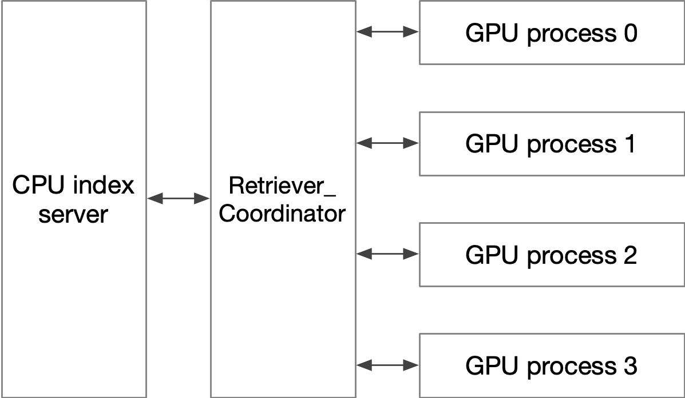
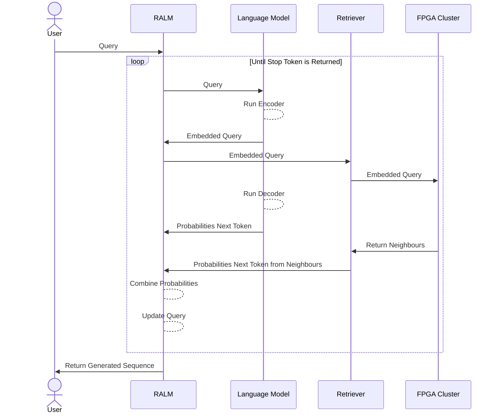

# RALM

## Multi-GPU support by using a coordinator process



The architecture of multi-gpu inference is visualized above. 

Essentially, we use multiple independent processes for multi-GPU inference. Pytorch has weird behavior when directly applying with python multithread and multiprocessing libraries. In the multi-thread mode, there is actually only one CPU core used, and the inference is not viewed as an I/O, thus we pay multiple times of inference time even using multiple GPUs. The multiprocessing results can be found in fairseq_examples/fairseq_encoder_manual_multi_gpu_failed.py , which actually lead to some CUDA related errors probably because inappropriate spawing of the process. 

As a result, we use multiple independent processes, one per GPU. In each process, the retriever intiates a connection to the retriever coordinator (`ralm/retriever/retriever_coordinator_server.py`), which forward the request to the CPU index server while records which GPU pairs with which request. It then forward the results to the right GPU process. 

To simulate such a procedure, we can use one random answer server, one coordinator, and, e.g., two retriever processes.

```
  In terminal 1, start the server:
    cd ralm/server
	python server.py --host 127.0.0.1 --port 9091 --batch_size 32 --dim 512 --k 10 --nprobe 32 --request_with_lists 1 --delay_ms 0
    
  In terminal 2, start the cooridnator 
  	# NOTE! num_queries_per_gpu must be calculated by ceil(seq_len / retrieval_interval) * batch_size), x2 for tik-tok:
    cd ralm/retriever
    python retriever_coordinator_server.py --index_server_host 127.0.0.1 --index_server_port 9091 \
        --local_port 9090 --ngpus 2 --batch_size 32 --num_queries_per_gpu 1024 --k 10 --dim 512 --nprobe 32 --request_with_lists 1
         
  In terminal 3 ~ 4, start the RALM processes:
    cd ralm_examples
    
    # set different gpu IDs
	python ralm_external_retriever.py --dim 512 --layers_encoder 2 --layers_decoder 12 --attention_heads 16 --model_type decoder \
    --host 127.0.0.1 --port 9090  --k 10 --retrieval_interval 1 --retrieval_token_len 64 --seq_len 512 --request_with_lists 1 --nlist 32768 --nprobe 32 \
    --batch_size 32 --n_batch 1 --use_gpu_id 0  --use_tiktok 1

	python ralm_external_retriever.py --dim 512 --layers_encoder 2 --layers_decoder 12 --attention_heads 16 --model_type decoder \
    --host 127.0.0.1 --port 9090  --k 10 --retrieval_interval 1 --retrieval_token_len 64 --seq_len 512 --request_with_lists 1 --nlist 32768 --nprobe 32 \
    --batch_size 32 --n_batch 1 --use_gpu_id 1  --use_tiktok 1
```

Please note that the starting order of these processes must be correct, and the port and host settings between these processes must be consistent.  


## Flow of Data and Responsibility


